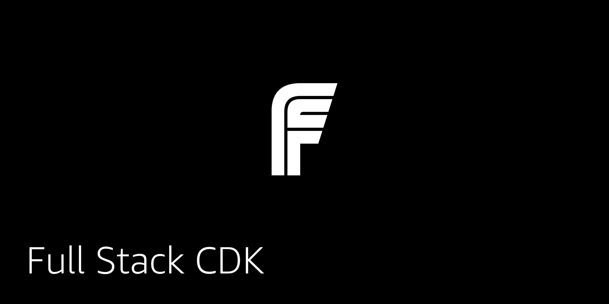

# Full Stack Serverless - CDK

Full stack cdk example applications

## Apps

### CDK Chat App

This CDK project deploys an AppSync API, Amazon DynamoDB tables, and an Amazon Cognito User Pool configured to create the infrasstructure for a chat application. It is paired with a React front-end for a full-stack serverless project.

[CDK AppSync Chat](https://github.com/full-stack-serverless/cdk-appsync-chat)

### CDK Authentication

This CDK project deploys an Amazon Cognito User Pool configured to create the infrasstructure for a basic application for user authentication. It is paired with a React front-end for a full-stack serverless project.

[CDK Authentication](https://github.com/full-stack-serverless/cdk-authentication)

